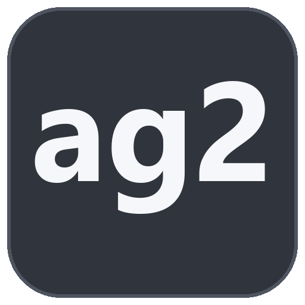
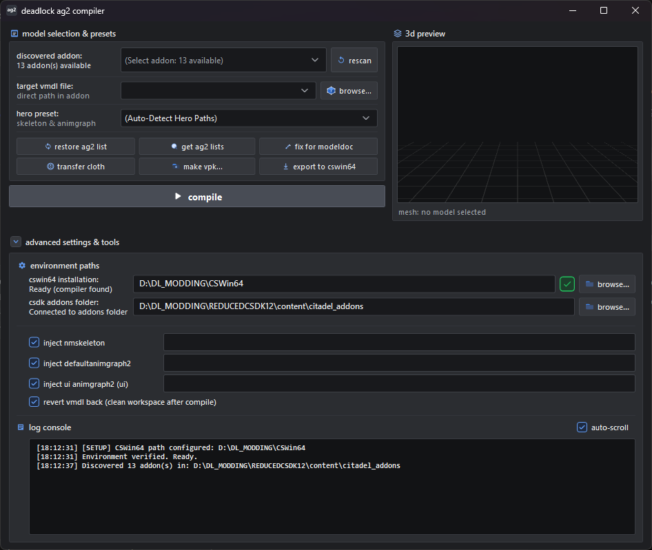

# Deadlock VMDL Compiler

  

  

A specialized GUI compiler and asset pipeline tool for Valve's Deadlock (Source 2). Bypasses CSDK12 limitations by automating CSWin64 ModelDoc compilation, AnimGraph 2 (AG2) skeleton and graph reference injection, and dynamic cloth physics generation.

---

## Why This Tool Exists

Deadlock uses AnimGraph 2 (AG2) animation structures. Standard CSDK12 tooling cannot compile AG2 nodes directly into .vmdl files. This tool solves the problem by:
1. Temporarily updating the .vmdl with compiled vanilla skeleton (.vnmskel) and AnimGraph (.vnmgraph) nodes.
2. Invoking the CSWin64 ModelDoc compiler to produce a fully valid compiled model (.vmdl_c).
3. Deploying the compiled asset directly to the target addon directory and restoring the working source file.

---

## Interface & Controls Reference

### Model Selection & Presets
- **discovered addon**: Auto-detects and lists all available addons in your content folder.
- **target vmdl file**: Selects the target .vmdl model file inside the selected addon.
- **hero preset**: Auto-detects or selects the hero archetype to assign corresponding skeleton and AnimGraph paths.

### Pipeline Actions
- **compile**: Runs the full automated compilation pipeline (injects AG2 references, compiles via CSWin64 ModelDoc, copies .vmdl_c to addon game directory, and restores source file).
- **transfer cloth**: Scans skeleton bone chains (hair, braids, tails, props, cuffs, chains, sleeves) and generates valid _class = "Softbody" cloth chains, collision spheres, and links custom .dmx cloth proxy meshes.
- **fix for modeldoc**: Cleans KV3 syntax, fixes bracket balance, and upgrades legacy ModelDoc definitions.
- **get ag2 lists**: Scans Deadlock's pak01_dir.vpk to extract up-to-date .vnmskel and .vnmgraph references for all heroes.
- **restore ag2 list**: Resets and reloads the default built-in hero preset database.
- **make vpk...**: Packages the active addon folder directly into a .vpk archive.
- **export to cswin64**: Copies the prepared source files directly to the CSWin64 workspace for manual inspection.

### Environment Paths & Options
- **cswin64 installation**: Path to your CSWin64 / CS2 bin directory containing the ModelDoc compiler.
- **csdk addons folder**: Path to your Deadlock content/citadel_addons directory.
- **inject nmskeleton**: Injects compiled vanilla .vnmskel reference before compiling.
- **inject defaultanimgraph2**: Injects compiled hero .vnmgraph reference before compiling.
- **inject ui animgraph2**: Injects compiled hero UI .vnmgraph reference before compiling.
- **revert vmdl back**: Automatically restores the clean source .vmdl file after compilation finishes.

### Visuals
- **3D preview**: Interactive real-time 3D viewport with textured mesh rendering and camera controls.
- **log console**: Real-time output log tracking all compiler steps and status.

---

## Installation & Usage

### Running Prebuilt Binary
1. Download the latest release from the [Releases](https://github.com/kwlnd/deadlock-vmdl-compiler/releases) page.
2. Extract the archive and launch DeadlockVmdlCompiler.exe.
3. Set your **CSWin64 bin directory** (e.g. .../game/csgo/bin/win64 or .../game/bin/win64).
4. Set your **Citadel Addons directory** (e.g. .../content/citadel_addons).
5. Select the target addon and model, and click **compile** or **transfer cloth**.

---

## Building from Source

### Requirements
- .NET 10.0 SDK (or .NET 8.0+)
- Windows 10/11 x64

### Build
`ash
git clone https://github.com/kwlnd/deadlock-vmdl-compiler.git
cd deadlock-vmdl-compiler

dotnet build -c Release
dotnet publish DeadlockVmdlCompiler.csproj -c Release -o ./publish
`

---

## License
MIT License

---

## Credits & Inspiration

- Original workflow concept and pipeline idea by **Qusai**.

---

> [!WARNING]
> **Notice**: This project was developed with AI assistance for the Deadlock modding community.
