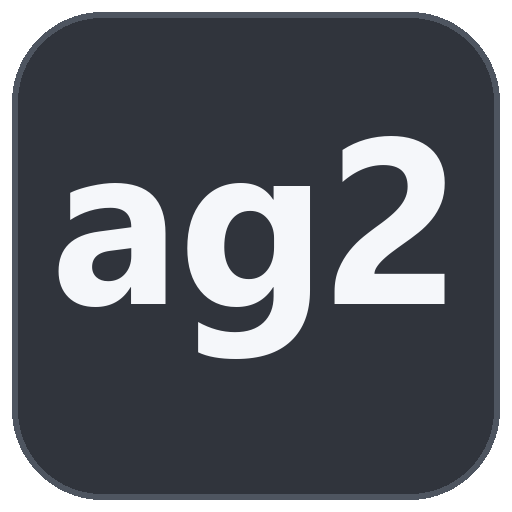
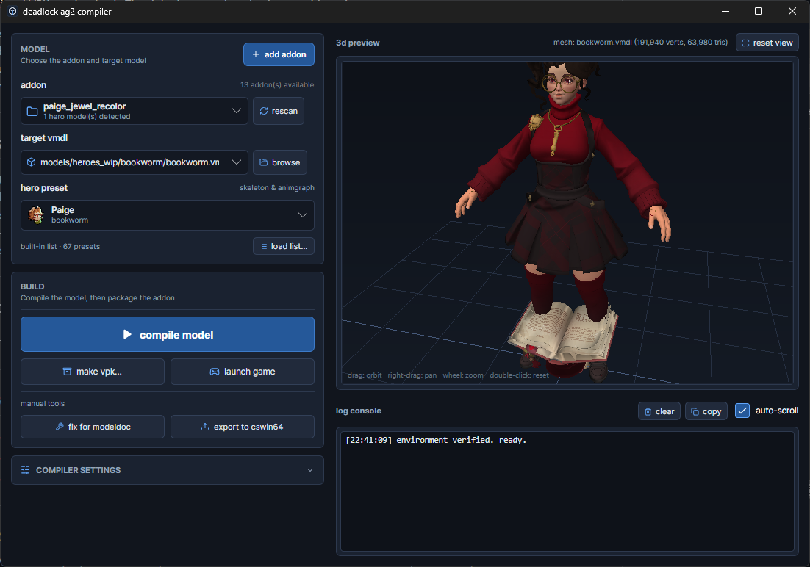

# Deadlock VMDL Compiler

<p align="center">
  
</p>

<p align="center">
  
</p>

A specialized GUI compiler and asset pipeline tool for Valve's Deadlock (Source 2). Bypasses CSDK12 limitations by automating CSWin64 ModelDoc compilation, AnimGraph 2 (AG2) skeleton and graph reference injection, and dynamic cloth physics generation.

---

## Why This Tool Exists

Deadlock uses AnimGraph 2 (AG2) animation structures. Standard CSDK12 tooling cannot compile AG2 nodes directly into .vmdl files. This tool solves the problem by:
1. Temporarily adding compiled vanilla skeleton (.vnmskel) and AnimGraph (.vnmgraph) references to a ModelDoc definition for CSWin64.
2. Invoking the CSWin64 ModelDoc compiler to produce a fully valid compiled model (.vmdl_c).
3. Verifying compiled AG2 references before deployment; with revert enabled, the CSDK .vmdl remains unchanged, and otherwise the injected version is saved.

---

## Interface & Controls Reference

### Model Selection & Presets
- **add addon**: Exports the selected hero's main model, animations, materials, textures, and available cloth assets into a CSDK12 addon using the original VPK paths. The catalog contains 44 heroes, including Baba, Deadman Danny, Nurse Harrow, Rat King, Solomon, and Violet, followed by the 19 AG2 neutral creeps. A material that is absent from the game files is logged and skipped instead of failing the export. Cloth nodes may still need manual fixes. The September 2026 prerelease models reference default AG2 graphs that are not yet shipped in the installed VPK; presets retain those exact references.
- **discovered addon**: Auto-detects and lists all available addons in your content folder.
- **target vmdl file**: Selects the target .vmdl model file inside the selected addon. Hero models are listed from `heroes_wip` and `heroes_staging`; other models, such as neutral creeps, are listed when their file name matches a preset. Use **browse** for anything else.
- **hero preset**: Auto-detects or selects the hero archetype to assign corresponding skeleton and AnimGraph paths. **load list...** replaces the menu with your own preset file (see *Custom preset format*); **default list** returns to the built-in presets.
- **neutral presets**: The built-in list includes 19 neutral model variants with verified AG2 skeletons and `Neutrals` graph bindings. NPCs without those AG2 resources are excluded. Named graphs are injected with their original identifiers, and a missing UI graph is automatically skipped.

### Pipeline Actions
- **compile**: Runs the full automated compilation pipeline (injects AG2 references, compiles via CSWin64 ModelDoc, verifies the AG2 references in the compiled .vmdl_c before deployment, copies it to the addon game directory, and leaves the CSDK .vmdl unchanged when revert is enabled (otherwise it saves the injected version).
- **compile-to-VPK protection**: After a successful CSWin64 compile, the app holds a Windows read-only handle on the deployed `.vmdl_c` so CSDK12 cannot overwrite it while the user decides whether to create a VPK. VPK creation can still read the file. After packaging, the app reopens the archive and compares the length and SHA-256 of the selected model and all protected models against their Game addon files; protection is released only after this verification succeeds. If packaging fails, the user can keep the files locked and retry, decline packaging, or close the app to release the handles.
- **fix(modeldoc)**: Removes all AG2 nodes from decompiled .vmdl to prevent crash. It uses the same cleaner as addon export, and only writes a backup when the file actually changes.
- **make vpk...**: Checks the selected compiled model for required AG2 references and refuses to pack if any are missing; requires a compiled Game addon and suggests `pak01_dir.vpk` in that folder as the output location.
- **export to cswin64**: Copies the prepared source files directly to the CSWin64 workspace for manual inspection.

### Environment Paths & Options
- **Deadlock installation**: Detected through Steam's registry/client location, `libraryfolders.vdf`, and `appmanifest_1422450.acf`. The manifest's `installdir` determines the game folder in each Steam library; no fixed drive paths or game folder names are required. If Steam metadata is unavailable, addon creation still offers manual VPK selection.
- **cswin64 installation**: Select the CSWin64 installation root that contains `game/bin/win64/resourcecompiler.exe`, not the `bin` directory itself. Selecting its `game` directory (containing `bin/win64/resourcecompiler.exe`) also works; `content` is then expected beside it.
- **csdk addons folder**: Path to your Deadlock content/citadel_addons directory.
- **inject nmskeleton**: Injects compiled vanilla .vnmskel reference before compiling.
- **inject animgraph2 (default & named)**: Injects the compiled default graph and any named graph bindings supplied by the preset.
- **inject ui animgraph2**: Injects compiled hero UI .vnmgraph reference before compiling.
- **disable animationlist**: Forces the entire AnimationList off during compile. This manual override takes priority over automatic detection. Uncheck to preserve animations.
- **auto-detect animations**: Keeps available animation sources active and disables only missing clips in the temporary CSWin64 model. Existing per-clip mute flags are preserved. Sources are resolved at their authored paths, including model-relative paths; referenced animations outside the model folder are copied to the matching CSWin64 addon paths. Turn this option off to compile all configured clips without automatic filtering. Both settings are saved, including settings from older versions.

### Visuals
- **3D preview**: Interactive real-time 3D viewport with mesh rendering and camera controls.
- **log console**: Real-time output log tracking all compiler steps and status.

### Custom preset format

Load a preset file with **load list...** under the hero preset menu. The choice is remembered between sessions.

Use the existing `skel`, `graph`, and `ui_graph` fields for hero presets. A preset can also supply `named_graphs`, preserving graph identifiers used by NPCs. For example:

```json
{
  "my_mushroom": {
    "skel": "models/npc_units/neutral_mushroom_small_01/neutral_mushroom_small_01.vnmskel",
    "graph": "",
    "ui_graph": "",
    "named_graphs": {
      "Neutrals": "animgraphs/animgraph2/npc_units/neutrals/npc_neutral.vnmgraph+mushroom_small.vnmgraph"
    }
  }
}
```

JSON comments and trailing commas are accepted. Optional JSON files beside the EXE are preserved by `publish.ps1`; the application itself remains a single self-contained executable.

---

## Installation & Usage

### Running Prebuilt Binary
1. Download the latest release from the [Releases](https://github.com/kwlnd/deadlock-vmdl-compiler/releases) page.
2. Extract the archive and launch DeadlockVmdlCompiler.exe.
3. Set your **CSWin64 installation root**: the directory containing `game/bin/win64/resourcecompiler.exe` or `bin/win64/resourcecompiler.exe` (not the `bin` directory itself).
4. Set your **CSDK12 Addons directory** (e.g. .../content/citadel_addons).
5. Select the target addon and model, and click **compile**.

---

## Building from Source

### Requirements
- .NET 10.0 SDK
- Windows 10/11 x64

### Build
```bash
git clone https://github.com/kwlnd/deadlock-vmdl-compiler.git
cd deadlock-vmdl-compiler

dotnet build -c Release
PowerShell -NoProfile -ExecutionPolicy Bypass -File .\publish.ps1

# The Windows x64 publication is self-contained: one .exe with managed and native libraries.

# Run regression checks
dotnet run --project tests/RegressionChecks/RegressionChecks.csproj -c Release

```

Set `DEADLOCK_TEST_VPK` to the path of a real `pak01_dir.vpk` before running the regression command to enable the optional VPK smoke check. The default regression checks run without it.

Pass `--steam-detection` to also verify discovery against the local Steam installation. The default checks cover modern and legacy library lists, renamed game directories, stale installations, and malformed manifests using temporary fixtures.
Pass `--new-hero-export` to additionally export and validate all six September 2026 heroes in temporary addon directories. Pass `--addon-export` to check Wraith's model and cloth export.

---

## User Data

Settings and user-specific hero paths are stored under `%LocalAppData%/DeadlockVmdlCompiler`. Edit `hero_paths.json` in the project and rebuild to change which presets appear in the menu; edit the local copy to change paths for existing presets. Legacy files beside the executable are read for compatibility.
Missing built-in presets are added in memory when loading an older local database, so new heroes are available to auto-detection while existing user paths are preserved.

---

## License
MIT License

---

## Credits & Inspiration

- Original concept idea by **Qusai** from the Deadlock Modding Discord server.
- Automatic animation source detection contributed by **Qusai0**, integrated with manual controls in v1.3.5.
- Icons and resource parsing powered by [ValveResourceFormat (Source 2 Viewer)](https://github.com/SteamDatabase/ValveResourceFormat) by SteamDatabase.

---

> [!WARNING]
> **Notice**: This project was developed with AI assistance for the Deadlock modding community.

